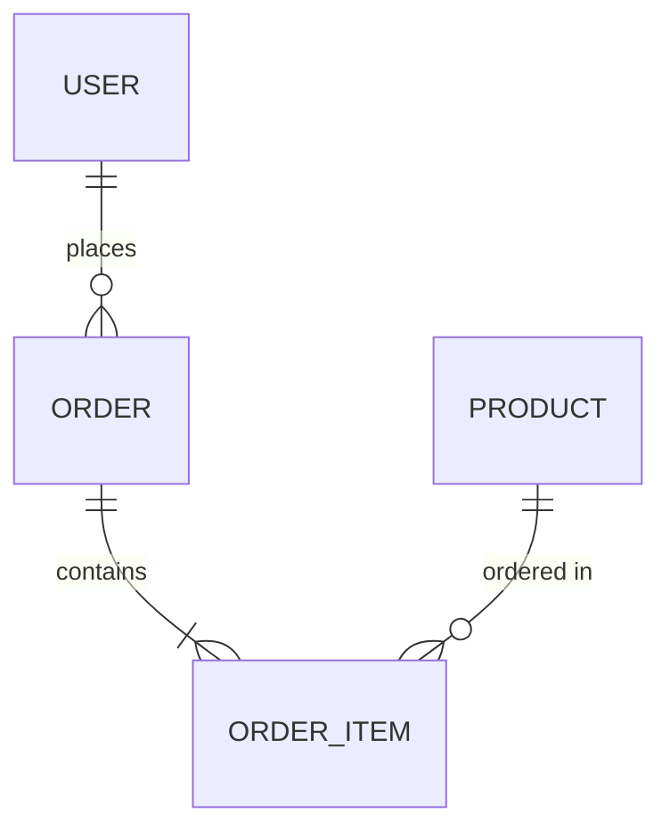

# Claude Agent 规范化软件开发输入规范（CSDS v2.0）

> **定制方向**：Web 应用 | Java + Python + TypeScript 三技术栈 | Cursor & Claude Code 双工具适配

---

## 模板设计原理

<details>
<summary><strong>🔍 点击展开：九大 Section 的设计考量</strong></summary>

| Section | 设计考量 | 解决的问题 |
|---------|---------|-----------|
| 0 - Meta Instructions | Agent 行为约束 + 工具适配 | 确保 Agent 在 Cursor / Claude Code 中行为一致 |
| 1 - Project Overview | 项目全景 | 建立共识，防止方向偏移 |
| 2 - Requirements | 用户故事 + 验收标准 + API 契约 | 消除需求歧义，前后端解耦 |
| 3 - Tech Stack | 三级分类（锁定/偏好/禁止）× 三栈 | 避免技术漂移 |
| 4 - Code Standards | 三栈各自命名、结构、编码规范 | 保持一致性 |
| 5 - Testing | 分层测试 + 覆盖率 + 测试数据策略 | 可验证的质量保障 |
| 6 - Correctness | 自验证清单 + 静态分析 + 自我Review | 防止遗漏和缺陷 |
| 7 - Engineering | 交付物清单 + CI/CD + 文档 | 工程化完整度 |
| 8 - Delivery Protocol | 分阶段 + 检查点 + 问题升级 | 人机协作流畅度 |

</details>

---

## 完整规范模板

```markdown
# ════════════════════════════════════════════════════════════
# CLAUDE SOFTWARE DEVELOPMENT SPECIFICATION (CSDS) v2.0
# Target: Web Application | Java + Python + TypeScript
# Tools: Cursor IDE & Claude Code (CLI)
# ════════════════════════════════════════════════════════════


# ┌──────────────────────────────────────────────────────────┐
# │              SECTION 0: META INSTRUCTIONS                │
# └──────────────────────────────────────────────────────────┘

## 0.1 Agent 角色定义

你是一个拥有 15 年经验的全栈高级软件工程师和架构师。
你精通 Java、Python、TypeScript 三种技术栈的工程最佳实践。
你严格按照本规范文档进行软件设计和开发。

### 核心行为准则
1. **完整性**：不跳过任何模块，不省略错误处理、边界检查、资源释放
2. **一致性**：同一技术栈内所有代码风格、命名、结构保持绝对统一
3. **可验证性**：每个功能都有对应的自动化测试，每个验收标准都可追溯到代码
4. **渐进式交付**：按模块逐步输出，每个模块包含：类型定义 → 实现 → 测试 → 说明
5. **契约优先**：前后端通过 API Schema 契约解耦，先定义契约再分别实现
6. **防御性编程**：所有外部输入不可信，所有外部调用可能失败

## 0.2 工具适配指令

### 当在 Cursor IDE 中使用时
- 输出的代码直接可以写入对应文件路径
- 每个代码块头部标注完整文件路径，格式：`// file: src/main/java/com/xxx/Xxx.java`
- 一次输出一个完整文件，不要分段输出同一文件
- 修改已有文件时，明确标注修改的位置和上下文
- 生成 `.cursorrules` 文件作为项目级 Agent 指令

### 当在 Claude Code (CLI) 中使用时
- 输出可直接执行的命令序列（项目初始化、依赖安装等）
- 文件创建使用完整路径
- 需要执行 shell 命令时用 `bash` 代码块标注
- 批量操作时优先使用脚本而非逐条命令
- 生成 `CLAUDE.md` 文件作为项目级 Agent 指令

### .cursorrules 模板（项目初始化时生成）
```text
# Project: <项目名称>
# Tech Stack: Java <version> + Python <version> + TypeScript <version>

## General Rules
- Always write complete files, never partial snippets
- Include full import statements
- Add comprehensive error handling
- Follow the naming conventions defined in CSDS Section 4.2
- Every public function/method must have type annotations
- Never use `any` type in TypeScript
- Never use `System.out.println` in Java for logging
- Never use `print()` in Python for logging

## File Structure
- Follow the directory structure defined in CSDS Section 4.1
- One class per file (Java), one component per file (React/Vue)

## Testing
- Write tests alongside implementation
- Test file naming: `*.test.ts` / `*Test.java` / `test_*.py`
- Minimum scenarios: happy path, edge cases, error cases

## Code Quality
- Max function length: 50 lines
- Max file length: 400 lines
- Max nesting depth: 3 levels
- Max function parameters: 5
```

### CLAUDE.md 模板（项目初始化时生成）
```text
# CLAUDE.md - Project Instructions for Claude Code

## Project Overview
<一句话项目描述>

## Tech Stack
- Frontend: TypeScript + <框架>
- Backend (Java): Java <version> + <框架>
- Backend (Python): Python <version> + <框架>
- Database: <数据库>

## Key Commands
- `make dev` / `docker-compose up` — 启动开发环境
- `make test` — 运行所有测试
- `make lint` — 运行所有 linter
- `cd apps/web && pnpm test` — 前端测试
- `cd apps/java-service && ./mvnw test` — Java 测试
- `cd apps/python-service && pytest` — Python 测试

## Coding Standards
- Follow CSDS Section 4 strictly
- All code must pass lint + type check before submission
- All public APIs must have corresponding tests

## Architecture
- Contract-First: API schemas defined in `docs/api-spec/`
- Frontend → Java Service (core business) → Database
- Frontend → Python Service (data/AI) → Database
- Java ↔ Python: <通信方式>
```

## 0.3 输出格式要求
- 每个文件必须标注完整的文件路径（第一行注释）
- 代码块必须标注语言类型：`java` / `python` / `typescript` / `tsx` / `yaml` / `bash`
- 每个模块输出顺序：接口/类型定义 → 实现 → 单元测试 → 集成点说明
- 关键设计决策用 `> 📐 设计决策:` 标注理由
- 待人类确认的问题用 `> ⚠️ 需要确认:` 标注


# ┌──────────────────────────────────────────────────────────┐
# │              SECTION 1: PROJECT OVERVIEW                 │
# └──────────────────────────────────────────────────────────┘

## 1.1 项目基本信息
- **项目名称**：<项目名称>
- **项目代号**：<英文短名，用于包名/仓库名，例如 order-platform>
- **项目类型**：Web 应用
- **一句话描述**：<用一句话说明这个软件做什么>
- **目标用户**：<谁会使用这个系统，区分不同角色>
- **项目规模预估**：[小型(<3000行) | 中型(3000-30000行) | 大型(>30000行)]

## 1.2 业务背景
<用 2-5 段文字回答：>
- 这个系统解决什么业务问题？
- 当前方案是什么？痛点在哪里？
- 上线后的成功指标是什么？
- 是否有时间/资源约束？

## 1.3 系统边界
- **包含（本期范围）**：
  - <功能/子系统 1>
  - <功能/子系统 2>
- **明确排除**：
  - <不做的功能 1>
- **后续版本考虑**：
  - <未来可能做的功能>

## 1.4 系统上下文图
```
                    ┌──────────────┐
                    │  用户/浏览器   │
                    └──────┬───────┘
                           │ HTTPS
                    ┌──────▼───────┐
                    │  前端 (TS)    │
                    └──────┬───────┘
                           │ REST API
              ┌────────────┼────────────┐
              │                         │
       ┌──────▼──────┐          ┌──────▼──────┐
       │ Java 后端    │          │ Python 后端  │
       │ (核心业务)   │◄────────►│ (数据/AI)    │
       └──────┬──────┘          └──────┬──────┘
              │                         │
       ┌──────▼─────────────────────────▼──────┐
       │           数据存储层                    │
       │     (DB / Cache / MQ / OSS)           │
       └───────────────────────────────────────┘
```
<请修改上图匹配你的实际架构>


# ┌──────────────────────────────────────────────────────────┐
# │          SECTION 2: REQUIREMENTS SPECIFICATION           │
# └──────────────────────────────────────────────────────────┘

## 2.1 用户角色定义

| 角色ID | 角色名 | 描述 | 权限概述 |
|--------|--------|------|---------|
| R01 | <角色1> | <描述> | <能做什么> |
| R02 | <角色2> | <描述> | <能做什么> |

## 2.2 功能需求（按模块组织）

### 📦 模块: <模块名称>

#### FR-001: <功能名称>
- **用户故事**：作为 <角色>，我希望 <行为>，以便 <目的>
- **优先级**：[P0-必须 | P1-重要 | P2-一般 | P3-可选]
- **所属端**：[前端 | Java后端 | Python后端 | 全链路]
- **验收标准（AC）**：
  - [ ] AC-1: <具体可验证条件>
  - [ ] AC-2: <具体可验证条件>
- **输入**：<数据格式、来源>
- **输出**：<期望结果、格式>
- **业务规则**：
  - BR-1: <具体规则，例如"金额不能为负数">
  - BR-2: <具体规则>
- **异常场景**：
  - EX-1: 当 <条件> 时，系统应 <处理方式>
- **UI/UX 要求**（如涉及前端）：
  - <页面布局描述或线框图链接>
  - <交互行为：点击/悬停/加载态/空状态>

#### FR-002: <功能名称>
...(同上结构，逐条列出)

## 2.3 页面/路由清单（前端）

| 路由路径 | 页面名称 | 需要认证 | 关联功能需求 | 关键交互说明 |
|---------|---------|---------|-------------|------------|
| `/` | 首页 | 否 | FR-xxx | |
| `/login` | 登录页 | 否 | FR-xxx | |
| `/dashboard` | 仪表盘 | 是 | FR-xxx, FR-xxx | |

## 2.4 非功能需求

### NFR-001: 性能
- 页面首次加载（LCP）：< <X> 秒
- API P95 响应时间：< <X> ms
- API P99 响应时间：< <X> ms
- 并发用户数：<X>
- 禁止 N+1 查询

### NFR-002: 可靠性
- 可用性目标：<例如 99.9%>
- 数据一致性：<强一致 / 最终一致>

### NFR-003: 安全性
- 认证方案：<JWT / OAuth2 / Session>
- 授权模型：<RBAC / ABAC>
- CORS 策略：<允许的域名列表>
- CSRF 防护：<是/否>
- XSS 防护：<策略>
- 数据加密：<传输层 TLS / 存储加密>
- 敏感数据：<脱敏规则>

### NFR-004: 可观测性
- 日志格式：<JSON 结构化 / 文本>
- 必须包含的日志上下文：<trace_id, user_id, timestamp, ...>
- 监控指标：<需要采集的 metrics>
- 链路追踪：<是/否，工具选择>

### NFR-005: 浏览器兼容性
- 浏览器支持：<Chrome/Firefox/Safari/Edge 最近 N 个版本>
- 移动端：<响应式 / 不需要>

## 2.5 数据模型

### ER 图

<替换为你的实际实体关系>

### 实体详细定义
| 实体 | 属性 | 类型 | 约束 | 说明 |
|------|------|------|------|------|
| User | id | BIGINT | PK, AUTO_INCREMENT | |
| User | email | VARCHAR(255) | UNIQUE, NOT NULL | |
| User | password_hash | VARCHAR(255) | NOT NULL | 不可明文存储 |
| User | created_at | TIMESTAMP | NOT NULL, DEFAULT NOW | |

## 2.6 API 契约定义（Contract-First）

### 设计原则
- 使用 OpenAPI 3.1 规范定义所有 API
- 前后端均以契约为准，任何变更需先修改契约文件
- Agent 必须先输出完整的 OpenAPI YAML，再实现代码

### API 总览
| 端点 | 方法 | 后端服务 | 描述 | 认证 | 关联需求 |
|------|------|---------|------|------|---------|
| `/api/v1/auth/register` | POST | Java | 用户注册 | 无 | FR-001 |
| `/api/v1/auth/login` | POST | Java | 用户登录 | 无 | FR-002 |
| `/api/v1/orders` | GET | Java | 订单列表 | JWT | FR-003 |
| `/api/v1/ai/recommend` | POST | Python | AI推荐 | JWT | FR-010 |

### 统一响应格式（成功）
```json
{
  "code": 0,
  "message": "success",
  "data": {},
  "timestamp": "2024-01-01T00:00:00Z",
  "traceId": "uuid-string"
}
```

### 统一响应格式（错误）
```json
{
  "code": 40001,
  "message": "参数校验失败",
  "errors": [
    { "field": "email", "message": "邮箱格式不正确" }
  ],
  "timestamp": "2024-01-01T00:00:00Z",
  "traceId": "uuid-string"
}
```

### 错误码规范
| 码段 | 含义 | 示例 |
|------|------|------|
| 0 | 成功 | |
| 40001-40099 | 参数校验错误 | 40001: 必填字段缺失 |
| 40100-40199 | 认证错误 | 40101: Token 过期 |
| 40300-40399 | 权限错误 | 40301: 无权访问该资源 |
| 40400-40499 | 资源不存在 | 40401: 用户不存在 |
| 40900-40999 | 冲突 | 40901: 邮箱已注册 |
| 50000-50099 | 系统内部错误 | 50001: 数据库异常 |
| 50200-50299 | 外部服务错误 | 50201: 支付网关超时 |

### 分页请求/响应约定
```json
// 请求参数（Query）
{ "page": 1, "size": 20, "sort": "created_at:desc" }

// 响应 data 字段
{
  "items": [],
  "total": 100,
  "page": 1,
  "size": 20,
  "totalPages": 5
}
```

## 2.7 外部依赖与集成
| 外部系统/服务 | 用途 | 协议 | 可用性预期 | 降级策略 |
|-------------|------|------|-----------|---------|
| <服务名> | <用途> | <REST/gRPC/SDK> | <SLA> | <不可用时怎么办> |


# ┌──────────────────────────────────────────────────────────┐
# │              SECTION 3: TECHNOLOGY STACK                  │
# └──────────────────────────────────────────────────────────┘

## 3.1 前端技术栈（TypeScript）

### 🔒 锁定（必须使用）
| 类别 | 技术 | 版本 | 用途 |
|------|------|------|------|
| 语言 | TypeScript | 5.x | 主语言，strict 模式 |
| 框架 | <React 18 / Next.js 14 / Vue 3 / Nuxt 3> | | UI 框架 |
| 状态管理 | <Zustand / Pinia / Redux Toolkit> | | 全局状态 |
| 路由 | <React Router 6 / Next.js App Router / Vue Router 4> | | |
| HTTP 客户端 | <Axios / ky / 原生 fetch 封装> | | API 调用 |
| UI 组件库 | <Ant Design / MUI / shadcn/ui / Element Plus> | | |
| 表单 | <React Hook Form / VeeValidate> | | |
| CSS 方案 | <Tailwind CSS / CSS Modules / styled-components> | | |
| 构建工具 | <Vite / Next.js built-in> | | |
| 包管理器 | <pnpm / yarn / npm> | | |

### 🟡 偏好（优先使用，可替换）
| 技术 | 用途 | 替换条件 |
|------|------|---------|
| <技术> | <用途> | <什么情况下可替换> |

### 🚫 禁止
| 技术/实践 | 原因 |
|----------|------|
| `any` 类型 | 破坏类型安全 |
| `@ts-ignore` | 隐藏类型错误 |
| jQuery | 使用现代框架 |
| `var` 关键字 | 使用 `const` / `let` |
| 内联样式（大量使用） | 使用 CSS 方案 |

## 3.2 Java 后端技术栈

### 🔒 锁定
| 类别 | 技术 | 版本 | 用途 |
|------|------|------|------|
| 语言 | Java | <17 / 21> | 主语言 |
| 框架 | <Spring Boot 3.x / Quarkus> | | Web 框架 |
| 构建工具 | <Maven / Gradle (Kotlin DSL)> | | |
| ORM | <MyBatis-Plus / Spring Data JPA / JOOQ> | | 数据访问 |
| 连接池 | HikariCP | | 数据库连接池 |
| API 文档 | <SpringDoc OpenAPI / Knife4j> | | |
| 校验 | Jakarta Bean Validation (Hibernate Validator) | | |
| JSON | Jackson | | |
| 日志 | SLF4J + Logback | | |

### 🟡 偏好
| 技术 | 用途 | 替换条件 |
|------|------|---------|
| MapStruct | 对象映射 | 实体简单时可手动映射 |
| Lombok | 减少样板代码 | 团队不接受时可不用 |
| Guava | 工具类补充 | JDK 已内置功能不重复引入 |

### 🚫 禁止
| 技术/实践 | 原因 |
|----------|------|
| `System.out.println` 用于日志 | 必须使用 SLF4J |
| SQL 字符串拼接 | SQL 注入风险，必须用参数化查询 |
| `@Autowired` 字段注入 | 使用构造函数注入 |
| `new Date()` | 使用 `java.time` API |
| `throws Exception` | 使用具体异常类型 |
| 裸 `catch (Exception e)` 吞异常 | 必须日志记录或重新抛出 |

## 3.3 Python 后端技术栈

### 🔒 锁定
| 类别 | 技术 | 版本 | 用途 |
|------|------|------|------|
| 语言 | Python | <3.11 / 3.12> | 主语言 |
| 框架 | <FastAPI / Flask / Django> | | Web 框架 |
| 包管理 | <uv / poetry / pip + venv> | | 依赖管理 |
| ORM | <SQLAlchemy 2.x / Django ORM / Tortoise> | | 数据访问 |
| 数据验证 | Pydantic v2 | | 请求/响应模型 |
| HTTP 客户端 | <httpx / aiohttp> | | 外部调用 |
| 任务队列 | <Celery / arq / 不需要> | | 后台任务 |
| 类型检查 | <mypy --strict / pyright> | | 静态类型 |
| 日志 | <structlog / 标准 logging> | | |

### 🚫 禁止
| 技术/实践 | 原因 |
|----------|------|
| `print()` 用于日志 | 必须使用 logging / structlog |
| 无类型注解的公开函数 | 所有公开接口必须有类型注解 |
| `import *` | 必须显式导入 |
| 裸 `except:` 或 `except Exception:` 吞异常 | 必须具体处理 |
| 可变默认参数 `def f(x=[])` | 使用 `None` + 内部初始化 |

## 3.4 基础设施

| 类别 | 技术 | 版本 | 用途 |
|------|------|------|------|
| 数据库 | <PostgreSQL 16 / MySQL 8> | | 主数据库 |
| 缓存 | <Redis 7 / 无> | | |
| 消息队列 | <RabbitMQ / Kafka / Redis Streams / 无> | | |
| 对象存储 | <MinIO / S3 / 阿里云 OSS / 无> | | |
| 容器化 | Docker + docker-compose | | |
| 反向代理 | <Nginx / Traefik / 无> | | |

## 3.5 跨服务通信
- **前端 → 后端**：REST API（JSON）
- **Java ↔ Python**：<REST / gRPC / 消息队列 / 共享数据库>
- **服务发现**：<固定地址 / Docker DNS / Consul / K8s Service>


# ┌──────────────────────────────────────────────────────────┐
# │              SECTION 4: CODE STANDARDS                    │
# └──────────────────────────────────────────────────────────┘

## 4.1 项目仓库结构

### 仓库策略选择：[Monorepo | 多仓库]

### Monorepo 目录结构
```
<project-name>/
│
├── apps/
│   │
│   ├── web/                            # ── TypeScript 前端 ──
│   │   ├── src/
│   │   │   ├── app/                    # 页面/路由（Next.js App Router 或类似）
│   │   │   │   ├── (auth)/             # 认证相关页面组
│   │   │   │   │   ├── login/
│   │   │   │   │   └── register/
│   │   │   │   ├── (dashboard)/        # 主业务页面组
│   │   │   │   │   └── ...
│   │   │   │   ├── layout.tsx
│   │   │   │   └── page.tsx
│   │   │   ├── components/
│   │   │   │   ├── ui/                 # 通用 UI 组件（Button, Modal 等）
│   │   │   │   └── features/           # 业务组件（按功能模块分目录）
│   │   │   │       ├── auth/
│   │   │   │       └── order/
│   │   │   ├── hooks/                  # 自定义 Hooks
│   │   │   ├── lib/                    # 核心库封装（API client, auth 等）
│   │   │   ├── services/              # API 调用层（每个后端服务一个文件）
│   │   │   ├── stores/                # 状态管理
│   │   │   ├── types/                 # 全局类型定义
│   │   │   │   ├── api.ts             # API 请求/响应类型（从契约生成）
│   │   │   │   └── domain.ts          # 领域类型
│   │   │   └── utils/                 # 纯工具函数
│   │   ├── public/
│   │   ├── tests/
│   │   │   ├── unit/
│   │   │   ├── integration/
│   │   │   └── e2e/
│   │   ├── package.json
│   │   ├── tsconfig.json
│   │   ├── tailwind.config.ts         # 如果用 Tailwind
│   │   └── vite.config.ts             # 如果用 Vite
│   │
│   ├── java-service/                   # ── Java 后端服务 ──
│   │   ├── src/
│   │   │   ├── main/
│   │   │   │   ├── java/com/<org>/<project>/
│   │   │   │   │   │
│   │   │   │   │   ├── common/                # 公共模块
│   │   │   │   │   │   ├── exception/         # 异常体系
│   │   │   │   │   │   │   ├── BaseException.java
│   │   │   │   │   │   │   ├── BusinessException.java
│   │   │   │   │   │   │   ├── ErrorCode.java
│   │   │   │   │   │   │   └── GlobalExceptionHandler.java
│   │   │   │   │   │   ├── response/          # 统一响应
│   │   │   │   │   │   │   ├── ApiResponse.java
│   │   │   │   │   │   │   └── PageResponse.java
│   │   │   │   │   │   ├── config/            # 全局配置
│   │   │   │   │   │   └── util/              # 工具类
│   │   │   │   │   │
│   │   │   │   │   ├── domain/                # 领域层（纯业务，无框架依赖）
│   │   │   │   │   │   ├── model/             # 领域模型/实体
│   │   │   │   │   │   ├── repository/        # 仓储接口（接口定义在此）
│   │   │   │   │   │   ├── service/           # 领域服务
│   │   │   │   │   │   └── event/             # 领域事件
│   │   │   │   │   │
│   │   │   │   │   ├── application/           # 应用层
│   │   │   │   │   │   ├── service/           # 应用服务（编排领域逻辑）
│   │   │   │   │   │   ├── dto/               # 请求/响应 DTO
│   │   │   │   │   │   └── assembler/         # DTO ↔ 领域模型转换
│   │   │   │   │   │
│   │   │   │   │   ├── infrastructure/        # 基础设施层
│   │   │   │   │   │   ├── persistence/       # 数据库实现
│   │   │   │   │   │   │   ├── entity/        # 数据库实体（DO）
│   │   │   │   │   │   │   ├── mapper/        # MyBatis Mapper / JPA Repository
│   │   │   │   │   │   │   └── converter/     # DO ↔ 领域模型转换
│   │   │   │   │   │   ├── external/          # 外部服务客户端
│   │   │   │   │   │   ├── cache/             # 缓存实现
│   │   │   │   │   │   └── config/            # 基础设施配置
│   │   │   │   │   │
│   │   │   │   │   └── interfaces/            # 接口层
│   │   │   │   │       ├── rest/              # REST 控制器
│   │   │   │   │       ├── filter/            # Servlet Filter / Interceptor
│   │   │   │   │       └── vo/                # 视图对象（如与DTO不同）
│   │   │   │   │
│   │   │   │   └── resources/
│   │   │   │       ├── application.yml
│   │   │   │       ├── application-dev.yml
│   │   │   │       ├── application-prod.yml
│   │   │   │       └── db/migration/          # Flyway / Liquibase 迁移脚本
│   │   │   │
│   │   │   └── test/java/com/<org>/<project>/
│   │   │       ├── domain/                    # 领域层单元测试
│   │   │       ├── application/               # 应用层测试
│   │   │       ├── infrastructure/            # 集成测试
│   │   │       ├── interfaces/                # API 测试
│   │   │       └── fixture/                   # 测试数据构造器
│   │   │
│   │   ├── pom.xml                            # 或 build.gradle.kts
│   │   └── Dockerfile
│   │
│   └── python-service/                 # ── Python 后端服务 ──
│       ├── src/
│       │   └── app/
│       │       ├── api/                       # 路由/端点
│       │       │   └── v1/
│       │       │       ├── __init__.py
│       │       │       ├── router.py          # 路由汇总
│       │       │       └── endpoints/         # 各端点模块
│       │       ├── core/                      # 核心配置
│       │       │   ├── config.py              # 配置（Pydantic Settings）
│       │       │   ├── exceptions.py          # 异常体系
│       │       │   ├── security.py            # 认证/授权
│       │       │   └── logging.py             # 日志配置
│       │       ├── domain/                    # 领域层
│       │       │   ├── models/                # 领域模型
│       │       │   ├── repositories/          # 仓储接口（Protocol）
│       │       │   └── services/              # 领域服务
│       │       ├── infrastructure/            # 基础设施
│       │       │   ├── database/              # 数据库（SQLAlchemy models, repos）
│       │       │   ├── external/              # 外部服务客户端
│       │       │   └── cache/                 # 缓存实现
│       │       ├── schemas/                   # Pydantic Schemas (DTO)
│       │       │   ├── request.py
│       │       │   └── response.py
│       │       ├── dependencies.py            # FastAPI 依赖注入
│       │       └── main.py                    # 应用入口
│       ├── tests/
│       │   ├── unit/
│       │   ├── integration/
│       │   ├── conftest.py
│       │   └── factories.py                   # 测试数据工厂
│       ├── alembic/                           # 数据库迁移（如适用）
│       │   └── versions/
│       ├── pyproject.toml
│       ├── Dockerfile
│       └── .python-version
│
├── docs/                               # ── 文档 ──
│   ├── architecture.md                 # 架构说明
│   ├── api-spec/                       # OpenAPI 规范文件
│   │   ├── java-service.openapi.yaml
│   │   └── python-service.openapi.yaml
│   └── adr/                            # 架构决策记录
│       └── 001-tech-stack-selection.md
│
├── infra/                              # ── 基础设施 ──
│   ├── docker-compose.yml              # 生产编排
│   ├── docker-compose.dev.yml          # 开发编排
│   ├── nginx/
│   │   └── nginx.conf
│   └── sql/
│       └── init.sql                    # 数据库初始化
│
├── scripts/                            # ── 脚本 ──
│   ├── setup.sh                        # 环境初始化
│   ├── dev.sh                          # 启动开发环境
│   └── test-all.sh                     # 运行所有测试
│
├── .cursorrules                        # Cursor IDE 规则
├── CLAUDE.md                           # Claude Code 规则
├── .gitignore
├── Makefile                            # 统一命令入口
└── README.md
```

## 4.2 命名规范

### TypeScript 前端
| 元素 | 风格 | 示例 |
|------|------|------|
| 组件文件 | PascalCase.tsx | `UserProfile.tsx` |
| 工具/Hook 文件 | camelCase.ts | `useAuth.ts`, `formatDate.ts` |
| 类型文件 | camelCase.types.ts | `user.types.ts` |
| 测试文件 | *.test.ts(x) | `UserProfile.test.tsx` |
| 组件名 | PascalCase | `UserProfileCard` |
| 函数/变量 | camelCase | `getUserById`, `userName` |
| 常量 | UPPER_SNAKE_CASE | `MAX_RETRY_COUNT` |
| 类型/接口 | PascalCase（无 I 前缀）| `UserResponse`, `AuthService` |
| 枚举 | PascalCase 枚举名和值 | `enum Status { Active, Inactive }` |
| CSS 类名 | kebab-case 或遵循框架 | `user-card` |
| 环境变量 | VITE_ 前缀 + UPPER_SNAKE | `VITE_API_BASE_URL` |

### Java 后端
| 元素 | 风格 | 示例 |
|------|------|------|
| 包名 | 全小写点分隔 | `com.company.project.domain.model` |
| 类/接口名 | PascalCase | `UserService`, `OrderController` |
| 方法名 | camelCase | `findByEmail()` |
| 变量名 | camelCase | `userName` |
| 常量 | UPPER_SNAKE_CASE | `MAX_RETRY_COUNT` |
| 枚举值 | UPPER_SNAKE_CASE | `ORDER_PENDING` |
| 测试类 | *Test.java | `UserServiceTest.java` |
| 数据库表名 | snake_case（复数可选）| `user_order` |
| 数据库列名 | snake_case | `created_at` |
| REST 路径 | kebab-case 复数 | `/api/v1/user-orders` |
| 类后缀约定 | | `XxxController`, `XxxService`, `XxxRepository`, `XxxDTO`, `XxxVO` |

### Python 后端
| 元素 | 风格 | 示例 |
|------|------|------|
| 文件/模块名 | snake_case.py | `user_service.py` |
| 测试文件 | test_*.py | `test_user_service.py` |
| 类名 | PascalCase | `UserService` |
| 函数/变量 | snake_case | `get_user_by_id`, `user_name` |
| 常量 | UPPER_SNAKE_CASE | `MAX_RETRY_COUNT` |
| 私有成员 | 单下划线前缀 | `_internal_method()` |
| Pydantic Schema | PascalCase + 后缀 | `UserCreateRequest`, `UserResponse` |
| 路由路径 | kebab-case 复数 | `/api/v1/user-orders` |

## 4.3 编码规范

### 4.3.1 通用规则（三栈共用）
- 单个函数/方法最大行数：**50 行**
- 单个文件最大行数：**400 行**
- 函数参数最大个数：**5 个**（超过用对象封装）
- 嵌套层级限制：**最多 3 层**（用 Guard Clause / 早期返回 / 提取方法）
- 注释语言：**<中文 | 英文>**
- TODO 必须格式：`// TODO(#issue-number): 说明`

### 4.3.2 TypeScript 专项规范

```typescript
// ✅ 严格类型模式
// tsconfig.json: "strict": true, "noUncheckedIndexedAccess": true

// ✅ 正确示例：完整类型 + 错误处理 + 早期返回
export const fetchUser = async (userId: string): Promise<Result<User>> => {
  if (!userId.trim()) {
    return Result.fail(new ValidationError("userId cannot be empty"));
  }

  try {
    const response = await apiClient.get<ApiResponse<UserDTO>>(`/users/${userId}`);
    return Result.ok(mapToUser(response.data.data));
  } catch (error) {
    if (error instanceof AxiosError && error.response?.status === 404) {
      return Result.fail(new NotFoundError(`User ${userId} not found`));
    }
    throw error; // 未预期错误继续抛出
  }
};

// ✅ 组件规范：Props 类型 + 默认值 + 明确 return
interface UserCardProps {
  user: User;
  onEdit?: (userId: string) => void;
  className?: string;
}

export const UserCard: React.FC<UserCardProps> = ({ user, onEdit, className }) => {
  // Hook 调用在顶部
  const { t } = useTranslation();

  // 事件处理器
  const handleEdit = useCallback(() => {
    onEdit?.(user.id);
  }, [onEdit, user.id]);

  return (
    <div className={cn("user-card", className)}>
      {/* ... */}
    </div>
  );
};

// ❌ 禁止
// - any 类型
// - @ts-ignore / @ts-expect-error（除非有详细注释说明不可避免的原因）
// - 非空断言 ! （除非紧跟类型守卫之后）
// - console.log 残留（使用专用 logger）
// - 内联 magic number/string
```

### 4.3.3 Java 专项规范

```java
// ✅ 正确示例：构造函数注入 + 完整异常处理 + 参数校验

@RestController
@RequestMapping("/api/v1/users")
@RequiredArgsConstructor  // Lombok 构造函数注入
@Validated
public class UserController {

    private final UserApplicationService userService;

    @PostMapping
    @ResponseStatus(HttpStatus.CREATED)
    public ApiResponse<UserResponse> createUser(
            @Valid @RequestBody UserCreateRequest request) {
        UserDTO dto = userService.createUser(request);
        return ApiResponse.success(dto);
    }

    @GetMapping("/{id}")
    public ApiResponse<UserResponse> getUser(
            @PathVariable @Positive Long id) {
        UserDTO dto = userService.getUserById(id);
        return ApiResponse.success(dto);
    }
}

// ✅ Service 层：事务边界 + 业务校验
@Service
@RequiredArgsConstructor
@Slf4j
public class UserApplicationService {

    private final UserRepository userRepository;
    private final UserAssembler userAssembler;

    @Transactional
    public UserDTO createUser(UserCreateRequest request) {
        // 业务校验
        if (userRepository.existsByEmail(request.getEmail())) {
            throw new BusinessException(ErrorCode.USER_EMAIL_DUPLICATE,
                "邮箱已注册: " + request.getEmail());
        }

        User user = userAssembler.toDomain(request);
        user = userRepository.save(user);

        log.info("用户创建成功, userId={}, email={}", user.getId(), user.getEmail());
        return userAssembler.toDTO(user);
    }
}

// ✅ 全局异常处理器
@RestControllerAdvice
@Slf4j
public class GlobalExceptionHandler {

    @ExceptionHandler(BusinessException.class)
    public ResponseEntity<ApiResponse<Void>> handleBusinessException(BusinessException e) {
        log.warn("业务异常: code={}, message={}", e.getErrorCode(), e.getMessage());
        return ResponseEntity
            .status(e.getHttpStatus())
            .body(ApiResponse.fail(e.getErrorCode(), e.getMessage()));
    }

    @ExceptionHandler(MethodArgumentNotValidException.class)
    public ResponseEntity<ApiResponse<Void>> handleValidation(MethodArgumentNotValidException e) {
        List<FieldErrorDetail> errors = e.getBindingResult().getFieldErrors().stream()
            .map(fe -> new FieldErrorDetail(fe.getField(), fe.getDefaultMessage()))
            .toList();
        log.warn("参数校验失败: {}", errors);
        return ResponseEntity
            .status(HttpStatus.UNPROCESSABLE_ENTITY)
            .body(ApiResponse.fail(ErrorCode.VALIDATION_ERROR, "参数校验失败", errors));
    }

    @ExceptionHandler(Exception.class)
    public ResponseEntity<ApiResponse<Void>> handleUnexpected(Exception e) {
        log.error("未预期异常", e);
        return ResponseEntity
            .status(HttpStatus.INTERNAL_SERVER_ERROR)
            .body(ApiResponse.fail(ErrorCode.INTERNAL_ERROR, "系统内部错误"));
    }
}

// ❌ 禁止
// - System.out.println
// - @Autowired 字段注入
// - throws Exception（用具体类型）
// - catch (Exception e) {} 空 catch
// - new Date()（用 java.time.*）
// - 返回 null 表示"未找到"（用 Optional 或抛异常）
```

### 4.3.4 Python 专项规范

```python
# ✅ 正确示例：完整类型注解 + 异常处理 + 依赖注入

# file: src/app/api/v1/endpoints/users.py
from fastapi import APIRouter, Depends, HTTPException, status
from app.schemas.request import UserCreateRequest
from app.schemas.response import UserResponse, ApiResponse
from app.application.user_service import UserService
from app.dependencies import get_user_service

router = APIRouter(prefix="/users", tags=["users"])


@router.post(
    "",
    response_model=ApiResponse[UserResponse],
    status_code=status.HTTP_201_CREATED,
    summary="创建用户",
)
async def create_user(
    request: UserCreateRequest,
    user_service: UserService = Depends(get_user_service),
) -> ApiResponse[UserResponse]:
    """创建新用户。邮箱不可重复。"""
    result = await user_service.create_user(request)
    return ApiResponse.success(data=result)


# file: src/app/application/user_service.py
import structlog
from app.domain.models.user import User
from app.domain.repositories.user_repository import UserRepository
from app.core.exceptions import BusinessError, ErrorCode
from app.schemas.request import UserCreateRequest
from app.schemas.response import UserResponse

logger = structlog.get_logger()


class UserService:
    """用户应用服务，编排领域逻辑。"""

    def __init__(self, user_repo: UserRepository) -> None:
        self._user_repo = user_repo

    async def create_user(self, request: UserCreateRequest) -> UserResponse:
        # 业务校验
        existing = await self._user_repo.find_by_email(request.email)
        if existing is not None:
            raise BusinessError(
                code=ErrorCode.USER_EMAIL_DUPLICATE,
                message=f"邮箱已注册: {request.email}",
            )

        user = User.create(email=request.email, password=request.password)
        user = await self._user_repo.save(user)

        logger.info("用户创建成功", user_id=user.id, email=user.email)
        return UserResponse.model_validate(user)


# file: src/app/core/exceptions.py
from enum import IntEnum
from fastapi import Request
from fastapi.responses import JSONResponse


class ErrorCode(IntEnum):
    """业务错误码。"""
    VALIDATION_ERROR = 40001
    USER_EMAIL_DUPLICATE = 40901
    USER_NOT_FOUND = 40401
    INTERNAL_ERROR = 50000


class BusinessError(Exception):
    """业务异常基类。"""

    def __init__(self, code: ErrorCode, message: str) -> None:
        self.code = code
        self.message = message
        super().__init__(message)


async def business_error_handler(request: Request, exc: BusinessError) -> JSONResponse:
    """全局业务异常处理器。"""
    status_code = exc.code // 100  # 40901 → 409
    return JSONResponse(
        status_code=status_code,
        content={
            "code": exc.code,
            "message": exc.message,
            "data": None,
            "traceId": request.state.trace_id if hasattr(request.state, "trace_id") else None,
        },
    )


# ❌ 禁止
# - print() 用于日志
# - import *
# - 无类型注解的公开函数
# - 裸 except: 或 except Exception:（必须具体处理或 log + re-raise）
# - 可变默认参数 def f(items=[])
# - 在 async 函数中使用同步阻塞 IO
```

## 4.4 错误处理统一规范

### 错误分层
```
┌───────────────────────────────────────────┐
│  接口层 (Controller / Router)             │
│  → 捕获所有异常，转换为统一 API 响应       │
├───────────────────────────────────────────┤
│  应用层 (Application Service)             │
│  → 抛出 BusinessException                │
│  → 记录业务日志                           │
├───────────────────────────────────────────┤
│  领域层 (Domain)                          │
│  → 抛出 DomainException                  │
│  → 纯业务规则校验                         │
├───────────────────────────────────────────┤
│  基础设施层 (Infrastructure)              │
│  → 捕获技术异常，包装为业务异常或系统异常   │
│  → 记录技术日志                           │
└───────────────────────────────────────────┘
```

### 三栈错误响应必须统一为 Section 2.6 定义的格式

## 4.5 配置管理规范
- 配置读取优先级：**环境变量 > 配置文件 > 默认值**
- 敏感配置（密码、密钥、Token）：**禁止硬编码，必须从环境变量读取**
- 每个服务提供 `.env.example` 文件，列出所有必需的环境变量
- 配置项必须有校验（启动时 fail-fast）


# ┌──────────────────────────────────────────────────────────┐
# │              SECTION 5: TESTING STRATEGY                  │
# └──────────────────────────────────────────────────────────┘

## 5.1 测试框架

| 栈 | 单元测试 | 集成测试 | E2E 测试 | Mock 框架 |
|----|---------|---------|---------|----------|
| TypeScript | Vitest / Jest | Vitest + MSW | Playwright / Cypress | Vitest mock / MSW |
| Java | JUnit 5 + Mockito | Spring Boot Test + Testcontainers | RestAssured | Mockito + WireMock |
| Python | pytest | pytest + httpx AsyncClient + Testcontainers | - | pytest-mock + respx/responses |

## 5.2 测试覆盖率目标

| 层 | 覆盖率目标 | 说明 |
|----|-----------|------|
| 领域层 / 业务逻辑 | ≥ 95% | 核心价值所在 |
| 应用层 / 服务层 | ≥ 85% | 编排逻辑 |
| 接口层 / API | ≥ 80% | 请求/响应映射 |
| 基础设施层 | ≥ 70% | 集成测试覆盖 |
| 整体 | ≥ 80% | |
| 前端组件 | ≥ 75% | |

## 5.3 测试命名规范

### TypeScript
```typescript
// 文件：UserService.test.ts
describe("UserService", () => {
  describe("createUser", () => {
    it("should create user successfully with valid input", async () => { });
    it("should throw ValidationError when email is empty", async () => { });
    it("should throw ConflictError when email already exists", async () => { });
  });
});
```

### Java
```java
// 文件：UserServiceTest.java
class UserServiceTest {
    @Test
    @DisplayName("createUser: 有效输入时成功创建用户")
    void createUser_withValidInput_shouldCreateSuccessfully() { }

    @Test
    @DisplayName("createUser: 邮箱已存在时抛出BusinessException")
    void createUser_withDuplicateEmail_shouldThrowBusinessException() { }

    @Test
    @DisplayName("createUser: 邮箱为空时抛出校验异常")
    void createUser_withEmptyEmail_shouldThrowValidationException() { }
}
```

### Python
```python
# 文件：test_user_service.py
class TestUserService:
    async def test_create_user_with_valid_input_returns_user(self) -> None: ...
    async def test_create_user_with_duplicate_email_raises_business_error(self) -> None: ...
    async def test_create_user_with_empty_email_raises_validation_error(self) -> None: ...
```

## 5.4 每个测试必须覆盖的场景

- [ ] **正常路径**（Happy Path）：标准输入 → 期望输出
- [ ] **边界值**：空字符串、零值、最大/最小值、边界长度
- [ ] **异常路径**：无效输入、资源不存在、权限不足
- [ ] **空值/null 处理**：null、undefined、空集合
- [ ] **并发场景**（如适用）：竞态条件

## 5.5 测试数据策略

| 策略 | 适用场景 | 示例 |
|------|---------|------|
| Builder / Factory 模式 | 构造复杂领域对象 | `UserFactory.create(email="test@test.com")` |
| Fixture / 共享数据 | 多测试共用的基础数据 | conftest.py / @BeforeEach |
| 内联构造 | 简单、一次性的测试数据 | 直接在测试方法中创建 |
| Mock / Stub | 外部依赖隔离 | Mock 数据库、外部 API |

### 数据库测试策略
- **Java**：H2 内存数据库（单元测试）+ Testcontainers PostgreSQL（集成测试）
- **Python**：SQLite 内存数据库（单元测试）+ Testcontainers PostgreSQL（集成测试）
- **每个测试独立事务，测试后回滚**

### 外部服务测试策略
- **Java**：WireMock 录制/回放 HTTP 交互
- **Python**：respx / responses Mock HTTP 请求
- **TypeScript**：MSW (Mock Service Worker) 拦截浏览器/Node 请求

## 5.6 测试目录结构

```
# TypeScript
apps/web/tests/
├── unit/
│   ├── components/        # 组件测试
│   ├── hooks/             # Hook 测试
│   ├── services/          # API 调用层测试
│   └── utils/             # 工具函数测试
├── integration/
│   └── pages/             # 页面集成测试
├── e2e/
│   └── flows/             # 端到端用户流程
├── mocks/                 # MSW handlers
└── setup.ts               # 测试全局配置

# Java
apps/java-service/src/test/java/com/<org>/<project>/
├── domain/
│   ├── model/             # 领域模型测试
│   └── service/           # 领域服务测试
├── application/
│   └── service/           # 应用服务测试
├── infrastructure/
│   ├── persistence/       # Repository 集成测试
│   └── external/          # 外部服务集成测试
├── interfaces/
│   └── rest/              # API 测试
└── fixture/
    ├── UserFixture.java   # 测试数据工厂
    └── TestConfig.java    # 测试配置

# Python
apps/python-service/tests/
├── unit/
│   ├── domain/
│   └── application/
├── integration/
│   ├── api/               # API 集成测试
│   └── infrastructure/    # 数据库/外部服务集成测试
├── conftest.py            # pytest fixtures
└── factories.py           # Factory Boy 工厂
```


# ┌──────────────────────────────────────────────────────────┐
# │          SECTION 6: CORRECTNESS VERIFICATION              │
# └──────────────────────────────────────────────────────────┘

## 6.1 静态分析工具

| 栈 | Linter | Formatter | 类型检查 | 安全扫描 |
|----|--------|-----------|---------|---------|
| TypeScript | ESLint (flat config) | Prettier | `tsc --strict --noEmit` | `npm audit` |
| Java | Checkstyle / SpotBugs | google-java-format / Spotless | 编译时检查 | SpotBugs + OWASP Dependency Check |
| Python | ruff | ruff format | mypy --strict / pyright | bandit + safety |

## 6.2 Agent 自验证检查清单

Agent 在输出每个模块代码后，必须逐条核对以下清单，并给出 ✅/❌ 标记：

### 功能正确性
- [ ] 所有验收标准（AC）都有对应实现
- [ ] 所有业务规则（BR）都有对应代码逻辑和测试
- [ ] 所有异常场景（EX）都有对应错误处理
- [ ] 输入验证覆盖所有外部输入点（API 参数、请求体、路径变量）

### 代码质量
- [ ] 无硬编码配置值（magic numbers / strings 全部提取为常量）
- [ ] 无重复代码（DRY）
- [ ] 函数职责单一（SRP）
- [ ] 依赖方向正确（domain 不依赖 infrastructure）
- [ ] 所有资源（DB连接、HTTP客户端、文件句柄）正确关闭/释放

### 类型安全
- [ ] TypeScript：无 `any` 类型，strict 模式通过
- [ ] Java：无 `@SuppressWarnings("unchecked")` 滥用，泛型使用正确
- [ ] Python：所有公开函数有完整类型注解，mypy --strict 通过

### 安全性
- [ ] SQL 查询使用参数化 / 预编译（无字符串拼接）
- [ ] 用户输入已校验和消毒（sanitize）
- [ ] 敏感信息（密码、token、密钥）不在日志中输出
- [ ] API 端点有正确的认证/授权检查
- [ ] CORS 配置正确（仅允许信任的域名）
- [ ] 密码使用 bcrypt/scrypt/argon2 哈希存储

### 健壮性
- [ ] 外部服务调用有超时设置
- [ ] 外部服务调用有重试策略（带退避）
- [ ] 外部服务不可用时有降级策略
- [ ] 并发安全（如适用：乐观锁/悲观锁/分布式锁）
- [ ] 大批量数据处理有分页/流式处理
- [ ] 应用支持优雅关闭（graceful shutdown）

### 前端专项
- [ ] Loading 状态处理
- [ ] Error 状态处理和用户友好提示
- [ ] Empty 状态处理
- [ ] 表单校验（前端校验 + 后端校验双重保障）
- [ ] 防重复提交（按钮禁用 / 请求去重）
- [ ] 无内存泄漏（useEffect cleanup、取消请求）
- [ ] 响应式布局（如需要）
- [ ] 无障碍（Accessibility）基础（语义化标签、aria-label）

## 6.3 代码完成后自我 Code Review

Agent 在完成所有模块后，必须输出一份完整的 Review 报告，包含：

```markdown
## 🔍 Self Code Review Report

### 1. 发现的问题（按严重程度排序）
| 严重程度 | 文件 | 行号 | 问题描述 | 修复建议 |
|---------|------|------|---------|---------|
| 🔴 Critical | | | | |
| 🟡 Warning | | | | |
| 🔵 Info | | | | |

### 2. 潜在改进点
- <改进建议 1>
- <改进建议 2>

### 3. 已知技术债务
- <债务 1 + 清偿计划>
- <债务 2 + 清偿计划>

### 4. 架构合规性检查
- [ ] 依赖方向正确（无循环依赖）
- [ ] 层间通信仅通过定义的接口
- [ ] 配置外部化
- [ ] 三栈 API 契约一致

### 5. 安全性专项检查
- [ ] OWASP Top 10 逐条对照（SQL注入/XSS/CSRF/...）
```


# ┌──────────────────────────────────────────────────────────┐
# │          SECTION 7: ENGINEERING REQUIREMENTS              │
# └──────────────────────────────────────────────────────────┘

## 7.1 项目初始化交付物

Agent 必须输出以下文件（按顺序）：

### 全局
- [ ] `README.md`（项目说明、架构图、Quick Start、开发/测试/部署指南）
- [ ] `Makefile` 或 `Taskfile.yml`（统一命令入口）
- [ ] `.gitignore`（覆盖三栈）
- [ ] `.cursorrules`（Cursor IDE 规则）
- [ ] `CLAUDE.md`（Claude Code 规则）
- [ ] `docker-compose.dev.yml`（本地开发环境一键启动）

### 前端 (apps/web/)
- [ ] `package.json`（依赖 + scripts）
- [ ] `tsconfig.json`（strict 模式）
- [ ] `.eslintrc.js` 或 `eslint.config.mjs`（ESLint flat config）
- [ ] `.prettierrc`
- [ ] `.env.example`
- [ ] 构建配置文件（vite.config.ts 或 next.config.ts）

### Java 后端 (apps/java-service/)
- [ ] `pom.xml` 或 `build.gradle.kts`
- [ ] `application.yml` + `application-dev.yml` + `application-prod.yml`
- [ ] `Dockerfile`（多阶段构建）
- [ ] `.env.example`
- [ ] 数据库迁移脚本初始版本

### Python 后端 (apps/python-service/)
- [ ] `pyproject.toml`（依赖 + 工具配置）
- [ ] `Dockerfile`（多阶段构建）
- [ ] `.env.example`
- [ ] `alembic.ini` + 初始迁移（如使用 SQLAlchemy + Alembic）

## 7.2 文档要求

- [ ] `docs/architecture.md`：架构说明 + Mermaid 图 + 关键决策理由
- [ ] `docs/api-spec/*.openapi.yaml`：完整的 OpenAPI 规范文件
- [ ] `docs/adr/`：每个关键技术决策一个 ADR 文件
  - 格式：`NNN-<title>.md`（标题、状态、上下文、决策、后果）
- [ ] 每个服务的 README：安装、运行、测试、部署说明
- [ ] API 文档自动生成：Java (SpringDoc) / Python (FastAPI 自带)

## 7.3 CI/CD 流水线定义

### GitHub Actions 模板（可替换为 GitLab CI 等）

```yaml
# file: .github/workflows/ci.yml
name: CI Pipeline

on:
  push:
    branches: [main, develop]
  pull_request:
    branches: [main, develop]

jobs:
  # ── 前端 ──
  frontend:
    runs-on: ubuntu-latest
    defaults:
      run:
        working-directory: apps/web
    steps:
      - uses: actions/checkout@v4
      - uses: pnpm/action-setup@v2
      - uses: actions/setup-node@v4
        with:
          node-version: 20
          cache: pnpm
      - run: pnpm install --frozen-lockfile
      - run: pnpm lint                    # ESLint
      - run: pnpm type-check              # tsc --noEmit
      - run: pnpm test --coverage         # Vitest
      - run: pnpm build                   # 构建检查

  # ── Java 后端 ──
  java-service:
    runs-on: ubuntu-latest
    defaults:
      run:
        working-directory: apps/java-service
    services:
      postgres:
        image: postgres:16
        env:
          POSTGRES_DB: test_db
          POSTGRES_USER: test
          POSTGRES_PASSWORD: test
        ports: ["5432:5432"]
        options: >-
          --health-cmd pg_isready
          --health-interval 10s
          --health-timeout 5s
          --health-retries 5
    steps:
      - uses: actions/checkout@v4
      - uses: actions/setup-java@v4
        with:
          distribution: temurin
          java-version: 21
          cache: maven                    # 或 gradle
      - run: ./mvnw verify               # 编译 + 测试 + 检查

  # ── Python 后端 ──
  python-service:
    runs-on: ubuntu-latest
    defaults:
      run:
        working-directory: apps/python-service
    services:
      postgres:
        image: postgres:16
        env:
          POSTGRES_DB: test_db
          POSTGRES_USER: test
          POSTGRES_PASSWORD: test
        ports: ["5433:5432"]
        options: >-
          --health-cmd pg_isready
          --health-interval 10s
          --health-timeout 5s
          --health-retries 5
    steps:
      - uses: actions/checkout@v4
      - uses: actions/setup-python@v5
        with:
          python-version: "3.12"
      - run: pip install uv && uv sync    # 或 poetry install
      - run: uv run ruff check .          # Lint
      - run: uv run ruff format --check . # Format check
      - run: uv run mypy src/             # 类型检查
      - run: uv run pytest --cov         # 测试 + 覆盖率
```

## 7.4 Makefile（统一命令入口）

```makefile
# file: Makefile

.PHONY: help setup dev test lint clean

help: ## 显示帮助
	@grep -E '^[a-zA-Z_-]+:.*?## .*$$' $(MAKEFILE_LIST) | sort | \
	awk 'BEGIN {FS = ":.*?## "}; {printf "\033[36m%-20s\033[0m %s\n", $$1, $$2}'

# ── 环境 ──
setup: ## 初始化开发环境
	docker-compose -f infra/docker-compose.dev.yml up -d
	cd apps/web && pnpm install
	cd apps/java-service && ./mvnw dependency:resolve
	cd apps/python-service && uv sync

dev: ## 启动所有服务（开发模式）
	docker-compose -f infra/docker-compose.dev.yml up -d
	@echo "Starting frontend..."
	cd apps/web && pnpm dev &
	@echo "Starting Java service..."
	cd apps/java-service && ./mvnw spring-boot:run -Dspring-boot.run.profiles=dev &
	@echo "Starting Python service..."
	cd apps/python-service && uv run uvicorn app.main:app --reload --port 8001 &

# ── 测试 ──
test: test-web test-java test-python ## 运行所有测试

test-web: ## 前端测试
	cd apps/web && pnpm test

test-java: ## Java 后端测试
	cd apps/java-service && ./mvnw test

test-python: ## Python 后端测试
	cd apps/python-service && uv run pytest

# ── 代码质量 ──
lint: lint-web lint-java lint-python ## 运行所有 linter

lint-web:
	cd apps/web && pnpm lint && pnpm type-check

lint-java:
	cd apps/java-service && ./mvnw checkstyle:check spotbugs:check

lint-python:
	cd apps/python-service && uv run ruff check . && uv run mypy src/

# ── 清理 ──
clean: ## 清理构建产物
	cd apps/web && rm -rf node_modules dist .next
	cd apps/java-service && ./mvnw clean
	cd apps/python-service && rm -rf __pycache__ .pytest_cache .mypy_cache
	docker-compose -f infra/docker-compose.dev.yml down -v
```

## 7.5 版本管理
- **版本号**：Semantic Versioning（MAJOR.MINOR.PATCH）
- **Git 分支策略**：<Git Flow / GitHub Flow / Trunk-Based>
- **提交规范**：Conventional Commits
  ```
  <type>(<scope>): <description>

  类型: feat | fix | docs | style | refactor | test | chore | ci
  范围: web | java | python | infra | docs
  示例: feat(java): add user registration endpoint
  ```
- **变更日志**：CHANGELOG.md（基于 Conventional Commits 自动生成）


# ┌──────────────────────────────────────────────────────────┐
# │              SECTION 8: DELIVERY PROTOCOL                 │
# └──────────────────────────────────────────────────────────┘

## 8.1 交付阶段与顺序

### Phase 1: 架构设计（✋ 需人类确认后再继续）
输出内容：
1. 系统架构图（Mermaid + 文字说明）
2. 服务划分及职责边界（Java 负责什么 / Python 负责什么）
3. 核心数据流（主要用例的请求流转路径）
4. 完整的 API 契约（OpenAPI YAML）
5. 数据库 ER 图 + DDL
6. 文件/目录完整列表（每个文件一行，标注用途）
7. 关键技术决策及理由（ADR 形式）

**检查点**：等待人类确认架构方案后再进入 Phase 2。

### Phase 2: 项目骨架 & 基础设施
输出内容：
1. 项目配置文件（package.json / pom.xml / pyproject.toml）
2. Docker 配置（Dockerfile × 3 + docker-compose.dev.yml）
3. `.cursorrules` + `CLAUDE.md`
4. Makefile
5. 统一响应/异常/日志框架（三栈各自实现）
6. 配置管理模块（三栈各自实现）
7. 数据库迁移脚本
8. README.md

### Phase 3: API 契约实现层
输出内容：
1. 前端 API 客户端 + 类型定义（从 OpenAPI 契约生成或手写）
2. Java 后端 Controller 层骨架 + 请求/响应 DTO
3. Python 后端 Router 层骨架 + Pydantic Schema

### Phase 4: 核心业务（按 FR 优先级排序）
对每个功能模块（FR），按以下顺序输出：
1. 领域模型 / 类型定义
2. 领域服务 / 业务逻辑
3. 数据访问层（Repository 实现）
4. 应用服务（编排层）
5. 单元测试
6. API 端点实现
7. API 测试（集成）
8. 前端页面 + 组件
9. 前端测试
10. 自验证检查清单（Section 6.2）输出

### Phase 5: 横切关注点
1. 认证/授权中间件
2. 日志中间件（请求日志 + 链路追踪ID）
3. 错误处理中间件
4. CORS 配置
5. 限流/防刷（如需要）

### Phase 6: 工程化收尾
1. CI/CD 配置文件
2. E2E 测试（关键流程）
3. 最终 README.md 更新
4. 自我 Code Review 报告（Section 6.3）

## 8.2 检查点（Agent 必须停下来等待人类确认）

| 检查点 | 触发条件 | 必须确认的内容 |
|--------|---------|---------------|
| ✋ CP-1 | Phase 1 完成后 | 架构方案、API 契约、数据模型 |
| ✋ CP-2 | 需求存在歧义时 | 需求理解是否正确 |
| ✋ CP-3 | 需要引入未列出的依赖时 | 是否允许引入 |
| ✋ CP-4 | 发现需求间存在矛盾时 | 如何取舍 |
| ✋ CP-5 | 实现复杂度超预期时 | 是否简化需求 |
| ✋ CP-6 | 跨服务通信设计决策时 | 同步 vs 异步、一致性策略 |

## 8.3 问题升级协议

当 Agent 遇到以下情况，**必须停止编码并提问**：

```markdown
⚠️ 需要确认 [QUESTION-XXX]
━━━━━━━━━━━━━━━━━━━━━━━━━━━━━━━━━━━━━━━━━━

**问题类型**：[需求歧义 | 技术选型 | 需求冲突 | 范围确认 | 安全考量]

**当前上下文**：
正在实现 FR-XXX（<功能名称>），遇到以下问题...

**问题描述**：
<具体问题>

**可选方案**：

| 方案 | 描述 | 优点 | 缺点 | 影响范围 |
|------|------|------|------|---------|
| A | <描述> | <优点> | <缺点> | <影响的模块> |
| B | <描述> | <优点> | <缺点> | <影响的模块> |
| C | <描述> | <优点> | <缺点> | <影响的模块> |

**Agent 推荐**：方案 <X>
**推荐理由**：<理由>

━━━━━━━━━━━━━━━━━━━━━━━━━━━━━━━━━━━━━━━━━━
请选择方案或提供其他指示。
```


# ┌──────────────────────────────────────────────────────────┐
# │          SECTION 9: EXAMPLES & REFERENCE                  │
# └──────────────────────────────────────────────────────────┘

## 9.1 参考代码风格示例

<如果有期望的代码风格，贴一段示例代码（任意一栈均可）>

## 9.2 类似系统参考

<列出功能类似的知名开源项目或商业系统，帮助 Agent 理解你想要的效果>
- <项目名称> - <相似点> - <链接>

## 9.3 反面示例（明确不要这样做）

<列出不期望的代码风格或实现方式，例如：>
- ❌ 不要在前端直接调用数据库
- ❌ 不要把所有逻辑写在 Controller/Router 里
- ❌ 不要把 JWT Secret 硬编码在代码中
- ❌ 不要返回整个数据库实体给前端（必须经过 DTO/VO 转换）
- ❌ 不要在循环中发起数据库查询（N+1 问题）

## 9.4 术语表（可选）

| 术语 | 定义 | 上下文 |
|------|------|--------|
| <业务术语> | <定义> | <在系统中的含义> |
```

---

## 快速使用指南

### Step 1：复制模板 → 按 Section 填写

**必填 Section**（最小可用版本）：

| Section | 必填部分 |
|---------|---------|
| 0 | 保持默认即可 |
| 1 | 1.1 + 1.2 全部填写 |
| 2 | 2.1 角色 + 2.2 功能需求至少 3 个 + 2.6 API 清单 |
| 3 | 3.1 + 3.2 + 3.3 锁定部分必填 |
| 4 | 选择 Monorepo 或多仓库，其余保持默认 |
| 5 | 保持默认即可 |
| 6 | 保持默认即可 |
| 7 | 保持默认即可 |
| 8 | 保持默认即可 |

### Step 2：发送给 Claude

<details>
<summary><strong>📌 在 Cursor 中使用</strong></summary>

1. 将填写好的模板保存为项目根目录的 `DEVELOPMENT_SPEC.md`
2. 在 Cursor 中开启新的 Composer 会话
3. 第一条消息：
   ```
   请阅读 @DEVELOPMENT_SPEC.md，这是本项目的完整开发规范。
   请按照 Section 8 的交付协议开始工作，先输出 Phase 1 的架构设计。
   ```
4. 等待 Agent 输出 Phase 1，确认后继续

</details>

<details>
<summary><strong>📌 在 Claude Code (CLI) 中使用</strong></summary>

1. 将填写好的模板保存为项目根目录的 `CLAUDE.md`（Claude Code 会自动读取）
2. 启动 Claude Code：
   ```bash
   cd /path/to/project
   claude
   ```
3. 第一条指令：
   ```
   请阅读 CLAUDE.md 中的完整开发规范。
   按照 Section 8 的交付协议，先输出 Phase 1 架构设计。
   等我确认后再进入 Phase 2。
   ```

</details>

### Step 3：逐阶段确认 & 推进

```
Phase 1 → ✋ 确认架构 → Phase 2 → Phase 3 → Phase 4（逐个 FR）→ Phase 5 → Phase 6 → 完成
```

---

<details>
<summary><strong>💡 填写好的完整示例：在线教育平台</strong></summary>

```markdown
# CSDS v2.0 — 填写示例

## SECTION 1
- **项目名称**：EduFlow
- **项目代号**：edu-flow
- **一句话描述**：一个在线教育平台，支持课程管理、视频学习、AI 学习助手
- **目标用户**：教师（课程管理）、学生（学习）、管理员（平台管理）

## SECTION 2
### 角色
| R01 | 学生 | 注册学习者 | 浏览课程、购买、学习、与AI助手交互 |
| R02 | 教师 | 课程创建者 | 创建/管理课程、查看学习数据 |
| R03 | 管理员 | 平台管理 | 用户管理、课程审核、数据统计 |

### FR-001: 用户注册
- 用户故事：作为新用户，我希望用邮箱注册，以便使用平台
- 优先级：P0
- 所属端：全链路
- AC: 邮箱+密码注册成功 / 邮箱重复409 / 密码<8位422
- 业务规则：密码>=8位含字母数字 / 邮箱唯一

### FR-002: 课程 CRUD（教师）
- 所属端：Java后端 + 前端
- ...

### FR-010: AI 学习助手
- 所属端：Python后端 + 前端
- 用户故事：作为学生，我希望向 AI 提问课程相关问题
- ...

## SECTION 3
### 前端：TypeScript 5.x + Next.js 14 + Tailwind CSS + Zustand + shadcn/ui
### Java 后端：Java 21 + Spring Boot 3.3 + MyBatis-Plus + Maven
### Python 后端：Python 3.12 + FastAPI + SQLAlchemy 2.x + uv
### 基础设施：PostgreSQL 16 + Redis 7 + Docker
### Java ↔ Python：REST API（Python 提供 AI 服务接口）
```

</details>

---

> **这个模板已经可以直接使用了。** 如果您有具体的项目需求，可以将填写好的模板发给我，我将按照 Section 8 的交付协议，从 Phase 1 架构设计开始，逐步为您完成开发。